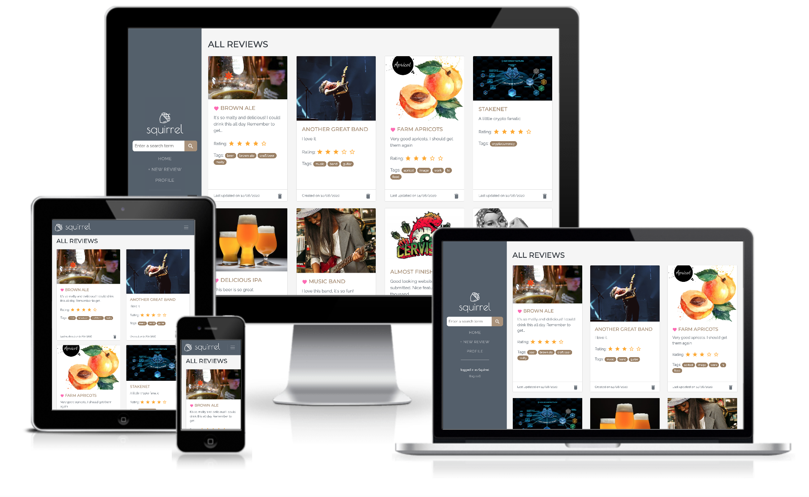
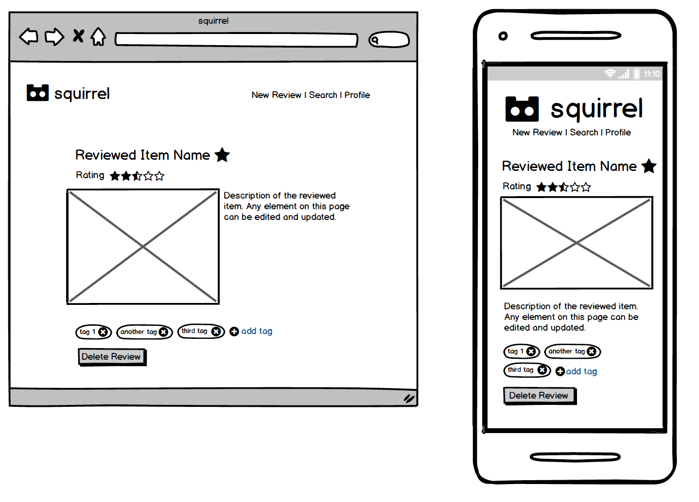
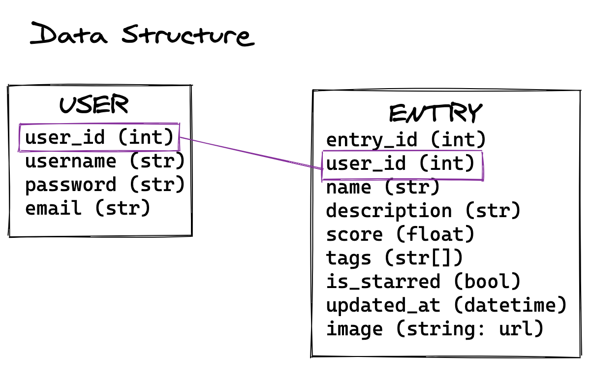

# squirrel

- [squirrel](#squirrel)
  - [UX](#ux)
    - [Project Goal](#project-goal)
    - [User Stories](#user-stories)
    - [Wireframes](#wireframes)
    - [Views and Data Structure](#views-and-data-structure)
    - [Design](#design)
      - [Typography](#typography)
      - [Color Scheme](#color-scheme)
  - [Features](#features)
    - [Existing Features](#existing-features)
      - [Account Registration](#account-registration)
      - [User Session](#user-session)
      - [About Page](#about-page)
      - [Create New Entries](#create-new-entries)
      - [List and Search Entries](#list-and-search-entries)
      - [View, Edit, and Delete Entries](#view-edit-and-delete-entries)
      - [Profile and Account Management](#profile-and-account-management)
      - [Send Feedback](#send-feedback)
      - [Security](#security)
    - [Features Left to Implement](#features-left-to-implement)
  - [Technologies Used](#technologies-used)
  - [Testing](#testing)
  - [Deployment](#deployment)
    - [Local Deployment](#local-deployment)
    - [Deployment to Heroku](#deployment-to-heroku)
  - [Credits](#credits)
    - [Media](#media)
    - [Acknowledgements](#acknowledgements)

---

Squirrel is an application that allows users to log reviews and ratings of products, places, restaurants, movies, songs, or anything they would wish to keep track of.
It is not meant to be a social application, but a repository of likes and dislikes for the user's future reference. Each entry can be tagged and starred to be made easily searchable, and also updated or deleted.



It has been deployed to heroku and can be viewed [here](https://squirrel-logbook.herokuapp.com/).

## UX

### Project Goal

The user's experience was at the front and center during the development of this project. One of the goals of the project was to create an application that is intuitive and satisfying to use. For this reason, Squirrel was built to be usable across all screen sizes,

Starting from user stories, some initial wireframes were sketched out, as well as the application's data structure.

### User Stories

-   As a user, I want to review a product, so that I can remember what I thought of it at a future date.
-   As a shopper, I want to find a previously reviewed product, so that I can make a shopping decision.
-   As a user, I want to update a review, if my opinion of it has changed.
-   As a user, I want to be able to delete a review, if it is not longer relevant
-   As a beer enthusiast, I want to be able to search through the beers I have consumed, so that I can see what I have tried.
-   As a consumer, I want to be able to categorize my entries, so that I can see results at a glance.
-   As a user, I want to be able to edit the categories in my reviews, so that I can reorganize my repository.
-   As a user, I want to search through entries I have created, to find a specific item.
-   As a user, I want to be able to upload images of what I review, so that I can look at them later
-   As a user, I want to be able to read through my reviews on a mobile device, so that I can access the information in a store.

### Wireframes

Following these user stories, wireframes were drawn to provide a starting point and guidance throughout the development process. The full wireframes can be found [here](readme-files/squirrel-wireframes.pdf).



The final design of the application departed from the original wireframe in slight ways:

-   The navigation moved from the top to the right hand side of the window on medium screen sizes and higher.
-   The page listing all reviews was made using bootstrap cards to make it more aesthetically pleasing.
-   The search was made a single text input in the navigation instead of a page of its own, to make it more accessible

### Views and Data Structure

Before starting the development of squirrel, its database's structure was delineated:



Each of the applications views and the actions that could be taken by the user were defined. These would later help decide which routes would need to be created with Flask. It was decided early on in this process that the "read" and "update" views for entries would be one and the same.


Data validation was also decided early in this process for any data that could be inputted by the user.


These elements remained roughly the same throughout the application's development, however some adjustments had to be made along the way. A few notable updates:

-   An image_id field was added to each entry to allow its deletion from cloudinary if the entry is deleted
-   The score field for each entry became a rating from 1 to 5
-   Some additional views were created for user registration and search results

### Design

The application was built using bootstrap and its responsive grid system. The [Start Bootstrap Resume Template](https://github.com/StartBootstrap/startbootstrap-resume) was used for the main structure of the site, and its default styling was overriden by a [style.css](static/css/style.css) file.

Fonts and colors were carefully chosen to give the application a distinctive brand and feel.

#### Typography

Three fonts are used throughout the site:

1. **Poiret One** for the logo

    > 

2. **Montserrat** for titles, this font is used exclusively in uppercase

    > 

3. **Raleway** for textual content such as paragraphs, tags, and navigation links
    >  

The marriage of these three fonts blends elegance and readability across the site.

#### Color Scheme

A simple color scheme was used to accentuate readability and usability.

-    `#535F6B - navy blue, primary color`

This color is used in the navigation, and is echoed throughout the site, in various buttons and links.
It was initially a lighter shade of blue, but was darkened to create a stronger contrast with the text in the navigation, for accessibility and readability purposes.

-    `#A99279 - light brown, secondary color`

The light brown is an accent found throughout the application. It highlights links and buttons that the user can interact, such as links to entries, tag buttons, the search button, etc...

-    `#FF69B4 - pink, favorite color`

This color is used exclusively to color the heart representing favorited reviews. It was chosen to stick out, so that these reviews can be easily seen in a list.

-    `#FFAA1D - yellow, rating color`

Similar to the favorite color, this yellow is used exclusively for the star ratings. It was also chosen to be easily identifiable at a glance.

-    `#F5F5F5 - off white, background color`

This off white was chosen for the background color for the site as it provides good contrast with the other chosen colors, but is less aggressive than a plain white.

## Features

### Existing Features

#### Account Registration

-   New users can register for a new account, choosing a username, email, and password
-   For the account to be created, all fields must pass validation:
    -   Username must be between 1 and 30 characters
    -   Email address must be recognized as an email address
    -   Password should be at least 8 characters
    -   Confirm password field should match the password field

#### User Session

-   Existing users can log into their account using their chosen email and password
-   If the "remember me" checbox is ticked, the session will endure after the browser is closed
-   Users can log out of their account and close the session
-   If a user has tried accessing a page from the application while logged out, they will be redirected to this page when they log in

#### About Page

The about page gives users an idea of the purpose of the application.
If the user is not logged in, an additional paragraph is generated with links to log in and register a new account.

#### Create New Entries

-   Users can create new entries into their squirrel account with the "New Review" navigation link
-   For the review to be added, the following fields can be filled and validation rules must be met:

    -   The name of the review is required, must be between 1 and 30 characters, and cannot start with a space.
    -   The description is a required field, must be between 1 and 2000 characters, and cannot start with a space or a line break.
    -   The rating gives the review a score between 1 and 5 and is required.
    -   The review can be made a favorite.
    -   An image can be chosen with a file selector. Only image will be accepted, and will be uploaded to [cloudinary](https://cloudinary.com/) via its API to be displayed on the entry's page.
    -   On a mobile device, the user has the option between using the device's camera or a photo from their library.
    -   Tags can be added with a tooltip created in javascript. These cannot contain special characters. The chosen tags will be added to a hidden field, separated by commas, to be added to the database.

-   If a review is added without an image, a default image will be set for this review

#### List and Search Entries

-   The main listing page will display all entries chronologically, by most recently created/updated to oldest.
-   It is possible to view only entries categorized with a tag by clicking on the tag link in the listing or in an entry page itself.
-   It is possible to search by entering a search phrase in the search field in the navigation. This will return a list of entries sorted by relevance.

#### View, Edit, and Delete Entries

-   By clicking the image or title of an entry in a listing, the entry's page will load and display the information inputted by the user.
-   Each field can be updated by clicking on it. The same validation rules as in the entry creation apply.
-   The updates are done asynchronously with AJAX requests, so that the page does not need to be loaded. A message will appear confirming the success (or failure) of the update.
-   As with the creation of a new review, updating the image from a mobile device gives the user the option between using the device's camera or a photo from their library.
-   If the image is updated, the previously used image will be removed from cloudinary.
-   Entries can be deleted by clicking the trashcan icon in a listing or entry page.

#### Profile and Account Management

-   The profile page features statistics about the squirrel's account: number of reviews, number of favorited reviews, average rating.
-   Clicking on the "Manage Account" button will make a modal window appear and give the user the possibility to update their username, email and/or password. The new information must conform to the validation rules described above. Additionally, the current password is needed to make any of these changes.

#### Send Feedback

A form was created to allow logged in users to send feedback about new features they would like to see implemented or bugs encountered in the application.
Currently the application is configured to send an email from a gmail address dedicated to the application, to this same email address.
The content of the email is the information provided by the user, along with the username and email address.

#### Security

Several steps were taken to ensure the security of the user's data.

-   The user's password is hashed upon creation or update, using the application's secret key. This ensures the password can never been seen, even in the database.
-   If a user has tried accessing a page while logged out, an argument is sent through the url to redirect to this page after login. For security reasons, this redirect only happens if the host redirected to is the same as the application's.

### Features Left to Implement

-   A password recovery system, that would send an email to a user's account, needs to be implemented.
-   The profile page should be expanded to display more information, such as the most used tags and the best rated reviews.
-   The listing page should be expanded to allow to view only favorited items.
-   A feature to share one or several items with other people (users or not) should be implemented.
-   A load bar will be added when new images are uploaded in an entry.
-   The option to remove an image and return the the default image should be implemented.

## Technologies Used

-   HTML
-   CSS
-   Bootstrap
-   JavaScript / JQuery
-   AJAX
-   Python
-   Flask
-   [The Padwan Project](https://github.com/Eventyret/Padawan)
-   [Cloudinary](https://cloudinary.com/) for all image uploads
-   [Cypress](https://www.cypress.io/) for testing throughout the development process
-   [Material Icons](https://material.io/) for all icons on the site
-   [CSS Autoprefixer](https://autoprefixer.github.io/)

## Testing

Testing was done manually throughout the development process and was also automated using [Cypress](https://www.cypress.io/). The full rundown of the testing can be found [here](TESTING.md).

Additionally, all code was validated in the following ways:

**HTML** - All pages were successfully run through the [W3C HTML Validator](https://validator.w3.org/) to ensure compliance with the standards set by the W3C.

**CSS** - CSS validation with the W3C's [Jigsaw Validator](https://jigsaw.w3.org/css-validator/) returned some expected and necessary flags from vendor extensions. Other than that, the code complies to the W3C standards.

**Python** - All Python code was checked with the [PEP8 online validator](http://pep8online.com/) and is PEP8 compliant.

## Deployment

Before deploying the application, ensure the following are installed:

-   [Python 3](https://www.python.org/)
-   [PIP](https://pypi.org/project/pip/)
-   [Git](https://git-scm.com/)
-   [Heroku CLI](https://devcenter.heroku.com/articles/heroku-cli)

The application relies on the following services, and accounts will have to be created for them:

-   [Cloudinary](https://cloudinary.com/)
-   [MongoDB](https://www.mongodb.com/)

### Local Deployment

These are the steps to deploy squirrel locally.

1.  From the application's [repository](https://github.com/jumboduck/squirrel/), click the "code" button and download the zip of the repository.

    Alternatively, you can clone the repository using the following line in your terminal:

        git clone https://github.com/jumboduck/squirrel.git

2.  Access the folder in your terminal window and install the application's required modules using the following command:

        python -m pip -r requirements.txt

3.  In MongoDB, create a new project called "squirrel", and in this project create a new database called "squirrel.

    This database will contain two collections: `users` and `entries`.

4.  Create a file containing your environmental variables called `env.py` at the root level of the application. It will need to contain the following lines and variables:

    ```
    import os

    os.environ["HOSTNAME"] = "0.0.0.0"
    os.environ["PORT"] = "5000"
    os.environ["SECRET_KEY"] = "YOUR_SECRET_KEY"
    os.environ["DEV"] = "True"
    os.environ["MONGO_URI"] = "YOUR_MONGODB_URI"
    os.environ["CLOUDINARY_URL"]= "YOUR_CLOUDINARY_URL"
    ```

    Please note that you will need to update the `SECRET_KEY` with your own secret key, as well as the `MONGO_URI` and `CLOUDINARY_URL` variables with those provided by those applications.

    If you plan on pushing this application to a public repository, ensure that `env.py` is added to your `.gitignore` file.

5.  The application can now be run locally. In your terminal, type the command `python3 run app.py`. The application will be available in your browser at the address `http://localhost:5000`.

### Deployment to Heroku

To deploy squirrel to Heroku, use the following steps:

1. Login to your Heroku account and create a new app.

2. Ensure the Procfile and requirements.txt files exist are present in your local repository.

    The Procfile should contain the following line:

    ```
    web: python app.py
    ```

    To ensure requirements.txt exists and is up to date, use the following line in your terminal:

    ```
    pip3 freeze --local > requirements.txt
    ```

3. Add heroku as a remote for your git repository by getting the heroku git URL for your application in its settings, and typing the following command:

    ```
    git remote add heroku https://git.heroku.com/your-heroku-git-url
    ```

4. Push squirrel to heroku with the following command:

    ```
    git push heroku master
    ```

5. In your terminal, enter the following line to prepare the application for launch once it is deployed

    ```
    heroku ps:scale web=5
    ```

6. In your app in heroku, go to settings, reveal the config vars and enter the following variables:

| Variable       | Value               |
| -------------- | ------------------- |
| HOSTNAME       | 0.0.0.0             |
| PORT           | 5000                |
| SECRET_KEY     | YOUR_SECRET_KEY     |
| MONGO_URI      | YOUR_MONGO_URI      |
| CLOUDINARY_URL | YOUR_CLOUDINARY_URL |
| MAIL_USERNAME  | YOUR_MAIL_USERNAME  |
| MAIL_PASSWORD  | YOUR_MAIL_PASSWORD  |
| MAIL_SERVER    | smtp.gmail.com      |
| MAIL_USE_SSL   | True                |
| MAIL_PORT      | 465                 |

Ensure to enter your own `SECRET_KEY`, `MONGO_URI`, `CLOUDINARY_URL`, `MAIL_PASSWORD`, `MAIL_PASSWORD` variables.
Please note that the application is currently set to use a gmail account for the feedback email. If using another type of service, you will need to replace the values of the variables `MAIL_SERVER` and `MAIL_PORT` accordingly, and potentially replace `MAIL_USE_SSL` with `MAIL_USE_TSL`.

1. Go to the deploy tab of your application, and click "Deploy Branch" under the manual deploy section.

2. squirrel is now deployed to heroku. It can be accessed by clicken the "Open App" button on the top right.

## Credits

### Media

-   Acorn logo from [Flaticon](https://www.flaticon.com/authors/freepik)

### Acknowledgements

-   Inspiration for this project came from conversations with my friend Cameron.
-   [Felipe Alarcon](https://github.com/fandressouza) for his helpful feedback and advice, and constant availability as a mentor
-   [Simen Daehlin](https://github.com/Eventyret) - [The Padwan Project](https://github.com/Eventyret/Padawan)
-   [Start Bootstrap Resume Template](https://github.com/StartBootstrap/startbootstrap-resume)
-   [Corey Schaefer](https://www.youtube.com/channel/UCCezIgC97PvUuR4_gbFUs5g) for his python tutorials on youtube, especially regarding registration and login forms
-   [Adam Orchard](https://codepen.io/orchard/pen/Jnwvb) for the 5 star rating code.
-   [Andy Osborne](https://github.com/Andy-Osborne) for helping with the search functionality
-   [KittySparkles](https://github.com/KittySparkles) for their support, encouragement and rigorous feedback throughout the project
-   Many thanks to the whole Code Institute community for their help and support
